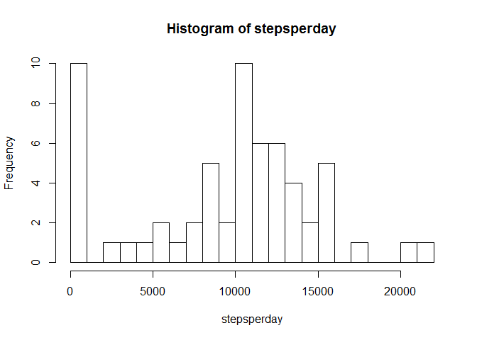
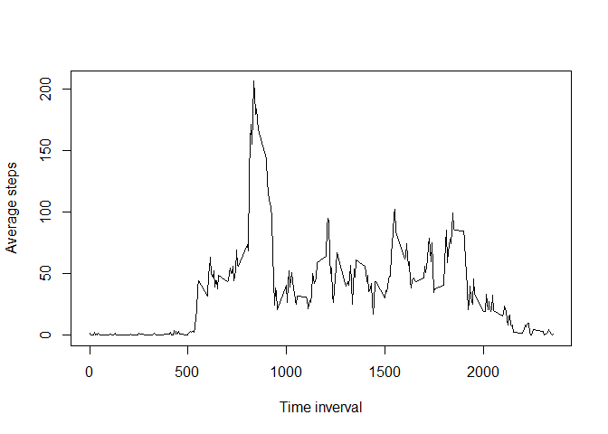
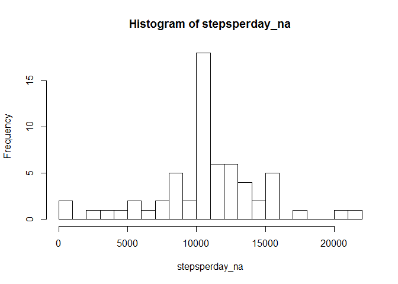
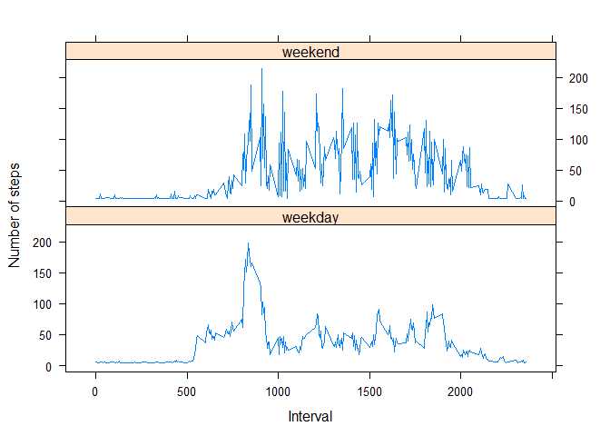

# Reproducible Research: Peer Assessment 1


## Loading and preprocessing the data

- First we need unzip and read data.

```r
unzip("activity.zip")
dat<-read.csv("activity.csv")
```
## What is mean total number of steps taken per day?

- Calculate the total number of steps taken per day

```r
stepsperday<-tapply(dat$steps,dat$date,sum,na.rm=TRUE)
```

- Build a histogram of the total number of steps taken each day

```r
hist(stepsperday,breaks=20)
```

 

- Calculate mean steps per day

```r
mean(stepsperday)
```

```
## [1] 9354.23
```
- and median

```r
median(stepsperday)
```

```
## [1] 10395
```

## What is the average daily activity pattern?
- Build a time-series plot of the 5-minute interval and the average number of steps taken, averaged across all days

```r
average_steps <- tapply(dat$steps, dat$interval, mean, na.rm = TRUE)
plot(as.numeric(rownames(average_steps)), average_steps, type = "l", xlab = "Time inverval", ylab="Average steps")
```

 

- Find the 5-minute interval, on average across all the days in the dataset, contains the maximum number of steps.

```r
which.max(average_steps)
```

```
## 835 
## 104
```

The 835-th interval has the maximum activity on the average.
## Imputing missing values
- Calculate the total number of missing values.

```r
sum(is.na(dat))
```

```
## [1] 2304
```

- Creadting a new dataset which equal to original.

```r
dat_na<-dat
```


- Replace NA values with the mean of total steps in new dataset.


```r
dat_na[is.na(dat_na$steps),]$steps <- as.integer(mean(dat$steps, na.rm = TRUE))
```

- Calculate the total number of steps taken per day for new dataset

```r
stepsperday_na<-tapply(dat_na$steps,dat_na$date,sum,na.rm=TRUE)
```

- Build a histogram of the total number of steps taken each day for new dataset

```r
hist(stepsperday_na,breaks=20)
```

 

- Calculate mean steps per day

```r
mean(stepsperday_na)
```

```
## [1] 10751.74
```
- and median for new data set

```r
median(stepsperday_na)
```

```
## [1] 10656
```

This values differs from original. By imputing missing values our data get more clearer.


## Are there differences in activity patterns between weekdays and weekends?

- Creating factor variable which indicates weekdays and weekends


```r
daytype <- weekdays(as.Date(dat_na$date)) == c("субота", "неділя")
dat_na$daytype <- daytype == FALSE
daytype = as.factor(dat_na$daytype)
levels(daytype) <- c("weekend", "weekday")
dat_na$daytype <- daytype
```
- Calculate average number of steps taken, averaged across all weekday days or weekend days.


```r
x <- dat_na[dat_na$daytype == "weekend", ]
y <- dat_na[dat_na$daytype == "weekday", ]
stepsByWeekend <- tapply(x$steps, x$interval, mean, na.rm = TRUE)
stepsByWeekday <- tapply(y$steps, y$interval, mean, na.rm = TRUE)
level <- rep(c("weekday", "weekend"), each = length(stepsByWeekday))
level <- factor(level, levels = c("weekday", "weekend"), labels = c("weekday", 
    "weekend"))
```

- Build plot with lattice

```r
z <- append(stepsByWeekday, stepsByWeekend)
z <- as.data.frame(z)
numberOfInterval <- 24 * 60/5
z <- cbind(z, dat_na$interval[1:numberOfInterval], level)
names(z) <- c("Value", "Interval", "Daytype")
library(lattice)
```

```
## Warning: package 'lattice' was built under R version 3.1.3
```

```r
xyplot(Value ~ Interval | Daytype, data = z, layout = c(1, 2), type = "l", xlab = "Interval", 
    ylab = "Number of steps")
```

 
